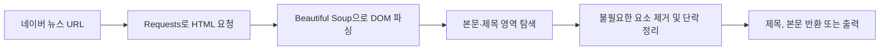

# naver-news-extractor

> 네이버 뉴스 기사 URL에서 제목과 본문을 추출하는 가벼운 Python 도구

네이버 뉴스 링크를 전달하면 기사 제목과 본문 텍스트를 분리해 반환합니다. 명령줄에서 바로 사용하거나, `get_naver_news_article_body` 함수를 다른 Python 코드에 가져와 사용할 수 있습니다.

## ✨ 주요 기능

| 기능 | 설명 |
| --- | --- |
| 기사 본문 추출 | `dic_area`와 `_article_body` 영역에서 기사 본문을 추출합니다. |
| 제목 추출 | `title_area`에서 기사 제목을 함께 가져옵니다. |
| 본문 정리 | 스크립트·스타일·사진 캡션 등 본문과 관계없는 요소를 제거하고 단락을 정리합니다. |
| CLI 지원 | URL 인수 전달과 대화형 입력을 모두 지원합니다. |
| 재사용 가능한 모듈 | 함수 호출 결과를 `(title, body)` 형태로 반환합니다. |

## 🛠 Tech Stack

| 구분 | 기술 | 용도 |
| --- | --- | --- |
| Language | Python 3.10+ | 명령줄 도구와 추출 모듈 구현 |
| HTTP | Requests | 기사 HTML 요청 및 상태 코드 확인 |
| HTML Parsing | Beautiful Soup 4 + lxml | 기사 DOM 탐색과 본문 정리 |
| Notebook | Jupyter Notebook | 사용 예시와 추출 결과 실험 |

## 🚀 시작하기

### 설치

```bash
git clone https://github.com/jaehunshin-git/naver-news-extractor.git
cd naver-news-extractor

python3 -m venv .venv
source .venv/bin/activate
pip install -r requirements.txt
```

Windows PowerShell에서는 가상 환경을 다음과 같이 활성화합니다.

```powershell
.venv\Scripts\Activate.ps1
```

### uv로 실행

[`uv`](https://docs.astral.sh/uv/getting-started/installation/)를 사용하면 별도의 가상 환경 활성화 없이 `requirements.txt`의 의존성을 설치하고 바로 실행할 수 있습니다.

```bash
uv run --with-requirements requirements.txt main.py "https://n.news.naver.com/mnews/article/..."
```

URL을 직접 입력하려면 인수를 생략합니다.

```bash
uv run --with-requirements requirements.txt main.py
```

### CLI 사용법

기사 URL을 인수로 넘깁니다.

```bash
python main.py "https://n.news.naver.com/mnews/article/..."
```

인수를 생략하면 URL을 직접 입력할 수 있습니다.

```bash
python main.py
```

성공하면 제목과 본문 글자 수를 포함한 결과를 출력합니다. 요청 실패 또는 본문 영역을 찾지 못한 경우 종료 코드 `1`을 반환합니다.

## 🧩 Python에서 사용하기

```python
from naver_news import get_naver_news_article_body

url = "https://n.news.naver.com/mnews/article/..."
title, body = get_naver_news_article_body(url)

if title and body:
    print(title)
    print(body)
else:
    print("기사 본문을 추출하지 못했습니다.")
```

함수는 요청 실패나 본문 추출 실패 시 `(None, None)`을 반환합니다. HTTP 요청의 시간 제한은 10초입니다.

## 🔍 추출 방식



- 본문은 우선 `#dic_area`에서 찾고, 없으면 `._article_body`를 사용합니다.
- `script`, `style`, 이미지·캡션 관련 요소 등을 제외한 뒤 문단을 두 줄 간격으로 연결합니다.
- 네이버 페이지 구조가 변경되면 본문 선택자를 보완해야 할 수 있습니다.

## 📁 프로젝트 구조

```text
naver-news-extractor/
├── .github/assets/
│   └── naver-news-banner.svg              # README 배너
├── naver_news.py                          # 기사 제목·본문 추출 함수
├── main.py                                # URL 입력·결과 출력 CLI
├── get_naver_news_article_body.ipynb      # 사용 예시·실험용 노트북
├── requirements.txt                       # Python 의존성
└── README.md
```

## 📝 참고 사항

- 이 도구는 공개적으로 접근 가능한 네이버 뉴스 기사 페이지를 대상으로 합니다.
- 기사 제공사의 정책과 네이버의 이용 약관을 준수해 사용하세요.
- 대량 요청 시에는 충분한 간격을 두고, 서비스에 불필요한 부하를 주지 않도록 주의하세요.
